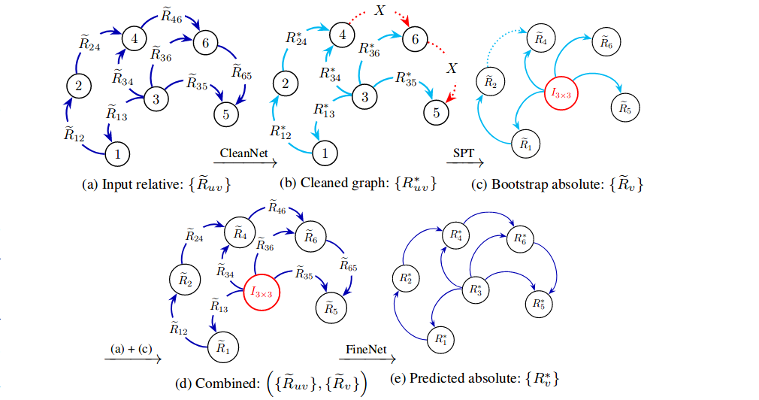

# NeuRoRA: Neural Robust Rotation Averaging

The current repository is based on pyTourch Geometric Toolbox (Python3 Notebook)
https://pytorch-geometric.readthedocs.io/en/latest/ 

For any query email to pulak.isi@gmail.com

If you find the code to be useful, please cite the following paper   
NeuRoRA: Neural Robust Rotation Averaging, P. Purkait, T.J. Chin and I. Reid, 
European Conference on Computer Vision 2020   
https://arxiv.org/pdf/1912.04485.pdf

## Requirements
The current 

* `pip install --verbose --no-cache-dir torch-scatter`
* `pip install --verbose --no-cache-dir torch-sparse`
* `pip install --verbose --no-cache-dir torch-cluster`
* `pip install --verbose --no-cache-dir torch-spline-conv` (optional)
* `pip install torch-geometric` 

## Creating datasets
The scripts to generate the synthetic datasets is adapted from the rotation averaging package of CV Lab of IISC Bangalore
http://www.ee.iisc.ac.in/labs/cvl/research/rotaveraging/

To generate synthetic data for NeuRoRA, run the following scripts in order 
* `Example_generate_data_pytourch.m`  
** This will generate the view-graphs and can directly fed to CleanNet for Training and Evaluatuion.                       
** Note that you need to execute the code twice to generate separate training and testing datasets.  
* `Outlier_detect_initialization.m`   
** It requires output of CleanNet to generate data for FineNet.   
** It does so by generating an initial solution of absolute pose from the cleaned graph.  

## Training

### CleanNet 

To train the CleanNet model, call:
* Run `jupyter notebook` on terminal 
* Open `CleanNet.ipynb` and run all   
** the CleanNet model

### FineNet 

To train the FineNet model, call:
* Open `FineNet.ipynb` and run all   
** the FineNet model 

## Testing

### Networks 

The analogous files `CleanNet.ipynb` and `FineNet.ipynb` can be incorporated 
* The above scripts have separate cells for training and evaluation 

### View-Graphs 

* `test_synthetic.m`  
** This reports the prediction accuracy 

For any query email to pulak.isi@gmail.com

